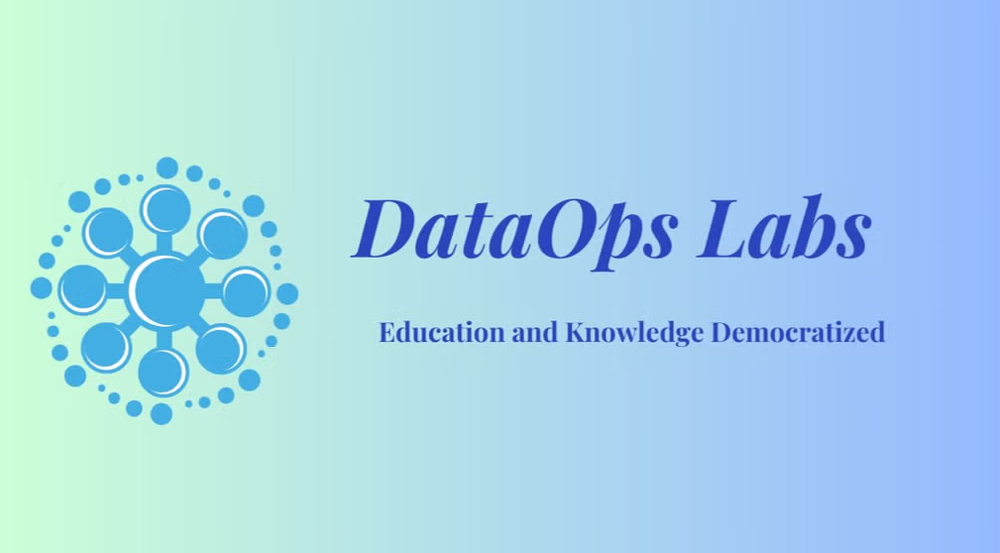
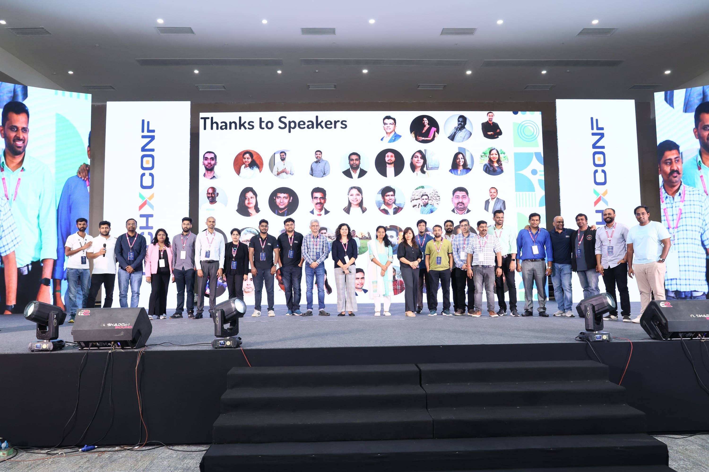
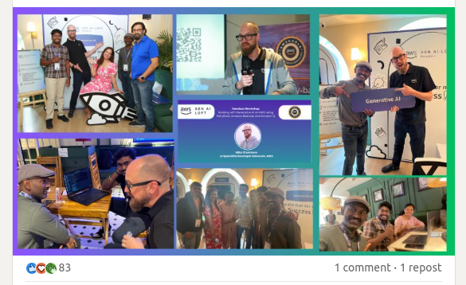
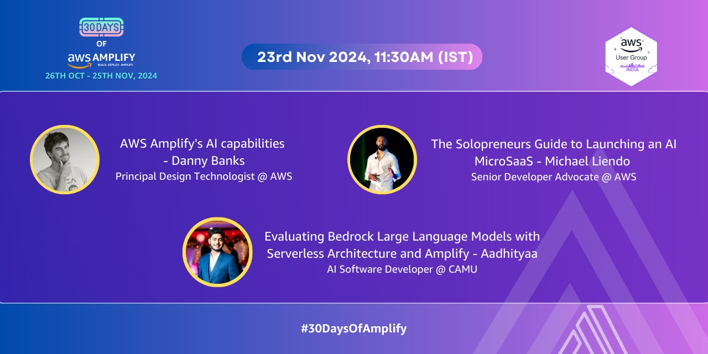

  
  

# 👋 Hi, I'm Aadhityaa!

### 🚀 AI Developer & Tech Innovator

🔭 Currently pioneering solutions in **Generative AI**, **AWS Bedrock**, and **NVIDIA** technologies  
🎯 Specializing in building enterprise-scale AI/ML solutions and blockchain applications  
🛠️ Working with cutting-edge tech at **Camu (Octoze Technologies Pvt Ltd)**  
🌱 Expanding expertise in **Go**, **BedRock Agents**, **AWS** and **Blockchain** technologies  
🤝 Open for consulting opportunities in AI, ML, and Blockchain  
💡 Patent holder for government-funded innovations in automation  

### 💫 Technical Focus:
 Advanced AI/ML Systems
 Blockchain & Crypto Technologies
 Image Processing
 Cloud Architecture (AWS)
 Metaverse Development

## 🌐 Connect with me:
  
  

<!-- 📚 **Certifications In Progress:**  
  
[AWS Certified Machine Learning - Specialty](https://aws.amazon.com/certification/certified-machine-learning-specialty/) -->

## 📝 **Read my insights:** [Medium Blog](https://medium.com/@aadhi0612)

---

# 📊 GitHub Stats

 

  

---

# Blog posts and Contributions 

<!-- BLOG-POST-LIST:START -->
- [Unveiling the World of &lpar;VAEs&rpar;](https://medium.com/@aadhi0612/unveiling-the-world-of-vaes-c2c5802b5830?source=rss-db543355fc99------2)
- [Are artificial intelligence and machine learning the same?](https://medium.com/@aadhi0612/are-artificial-intelligence-and-machine-learning-the-same-ec637cffe0bf?source=rss-db543355fc99------2)
- [Will artificial intelligence replace humans?](https://medium.com/@aadhi0612/will-artificial-intelligence-replace-humans-ad1fa59322b6?source=rss-db543355fc99------2)
- [Why artificial intelligence is important?](https://medium.com/@aadhi0612/why-artificial-intelligence-is-important-5ef045db8dcf?source=rss-db543355fc99------2)
- [Where AI is used?](https://medium.com/@aadhi0612/where-ai-is-used-e4dddda544c4?source=rss-db543355fc99------2)
- [The Role of Python Libraries and How to Utilize Them Effectively](https://medium.com/@aadhi0612/the-role-of-python-libraries-and-how-to-utilize-them-effectively-b0e8f7cfb4ee?source=rss-db543355fc99------2)
- [Building a Face Mask Detector using Python and OpenCV](https://medium.com/@aadhi0612/building-a-face-mask-detector-using-python-and-opencv-2654e28d8d76?source=rss-db543355fc99------2)
- [What is Generative AI: How does it Revolutionize AI](https://medium.com/@aadhi0612/what-is-generative-ai-how-does-it-revolutionize-ai-427e3fbc59fd?source=rss-db543355fc99------2)
- [What is a Neural Network? How to Visualize It? #Blog-2](https://medium.com/@aadhi0612/what-is-a-neural-network-how-to-visualize-it-blog-2-c119758a24e?source=rss-db543355fc99------2)
- [Understanding AI: How It Works and Its Impact](https://medium.com/@aadhi0612/understanding-ai-how-it-works-and-its-impact-5b39484cb0c9?source=rss-db543355fc99------2)
<!-- BLOG-POST-LIST:END -->

# TECHNICAL CONTRIBUTION && VOLUNTEERING
## Meetups Group:
### DATA OPS LABS

  

	
[Join Here](https://www.meetup.com/dataopslabs/)

One of the Organizer of the DataOps Labs meetups page & youtube channel. With more than 4-5 events every month!!

All the sessions are recorded and available in Youtube:

  

	
[Subscribe!!!](https://www.meetup.com/dataopslabs/)

## About DataOps Labs.

This is a community group of members join together and share Cloud, Data, AI, Generative AI, Machine Learning, DevOps and Security professionals where we will share experiences, Recent updates with use cases, technology challenges and trends.

Here all session were provided as knowledge sharing and their view only. Not opinion of company they associated.

Individual who interest in learn from industry experts on various topics include, Complex Application Architecture, Bigdata, AI/ML, MLOps, DevOps and Security with usecases.

## Meetups

Gave a speech and hands-on demo in 50+ meetups 25+ in person and the other 20+ virtual and another 5 in closed events.
Organized and contibuted multiple events.

# Public Speaking Posts
### LinkedIn Posts:

 

  <a href="https://techxconf.com/speakers/aadhityaa-sb-2024">Click Here To Know More</a>

**Title:** Speaker at Asia's Largest AI & Cloud Conference 

**Description:** I am delighted to share that I was one of the speaker at Asia's Largest AI & Cloud COnference TechXConference and shared Stage Along with **Ayyanar(AJ)**. We Gave a speech on The Topic  **Secure and Scalable LLAMA Model Deployment in High-Regulatation Environments with AWS EKS and NVIDIA NIM** with more than 5000+ participants and 40+ speakers in this event that happened for 2 days.

**Date:** November 15-16, 2024

Some Interesting People and awesome Picture:

  
  

  

  
  

    
    

  

___
 
___

 

  <a href="https://www.linkedin.com/feed/update/urn:li:ugcPost:7267092401570111490">Click Here To Know More</a>

**Title:** A Heartfelt Thanks to the TechXConf 2024 Team  
**Description:** I am delighted to share my appreciation for the fantastic experience at TechXConf 2024 in Chennai. With 5,000+ participants, 70+ speakers, and groundbreaking sessions, this event set a benchmark for tech conferences. I had the privilege of speaking on "Secure and Scalable LLAMA Model Deployment."  
**Date:** November 26, 2024
___
  

  <a href="https://www.linkedin.com/feed/update/urn:li:share:7265997894581723136">Click Here To Know More</a>

**Title:** Showcasing AWS Amplify with Bedrock  
**Description:** Aadhityaa SB showcased how he used AWS Amplify with Bedrock as part of AI Day on #30DaysOfAmplify. Kudos to the amazing work!  
**Date:** October 26, 2024
___
  

  <a href="https://www.linkedin.com/feed/update/urn:li:share:7265653028911808512">Click Here To Know More</a>

**Title:** Mark Your Calendars for AI Day!  
**Description:** Join us for AI Day as part of #30DaysOfAWSAmplify on November 23, 2024. Learn from industry experts about AI integration, serverless architecture, and launching AI-driven MicroSaaS.  
**Date:** November 23, 2024
___

  <a href="https://www.linkedin.com/feed/update/urn:li:ugcPost:7264036891249778690">Click Here To Know More</a>

**Title:** An Unforgettable Experience at TechXConf  
**Description:** Delivered a session on "Secure and Scalable LLAMA Model Deployment" at TechXConf to 4,000+ attendees. The electrifying energy and networking made it an unforgettable experience.  
**Date:** November 15-16, 2024
___
 

  <a href="https://www.linkedin.com/feed/update/urn:li:ugcPost:7264257672726614017">Click Here To Know More</a>

**Title:** Speaking on Agentic RAG at TechXConf  
**Description:** Attended Bhuvaneshwari Mams Session  "Agentic RAG: A Self-Corrective Method for Retrieval-Augmented Generation"
**Date:** November 15, 2024
___

  <a href="https://www.linkedin.com/feed/update/urn:li:share:7263587736228409345">Click Here To Know More</a>

**Title:** AWS Community Gathering at TechXConf  
**Description:** Had a fantastic time catching up with the AWS community at TechXConf. Thanks to everyone for making it memorable!  
**Date:** November 15-16, 2024
___

  <a href="https://www.linkedin.com/feed/update/urn:li:share:7246576990072254465">Click Here To Know More</a>

**Title:** Speaking at AWS Community Day Budapest  
**Description:** Thrilled to speak on "Unlocking AI Potential with Multi-Agent Systems and AWS Bedrock" at AWS Community Day Budapest. Thanks to AWS User Group Hungary for the opportunity.  
**Date:** October 4, 2024
___
 

  <a href="https://www.linkedin.com/feed/update/urn:li:share:7246230573273227266">Click Here To Know More</a>

**Title:** Unlocking AI Potential with AWS Bedrock  
**Description:** Excited to share insights on multi-agent system design and deployment with AWS Bedrock. Join us virtually for AWS Community Day Budapest!  
**Date:** October 7, 2024
___

  <a href="https://www.linkedin.com/feed/update/urn:li:share:7227661038383460353">Click Here To Know More</a>

**Title:** Learning at AWS GenAI Loft  
**Description:** Amazing workshop on building with Generative AI on AWS. Thanks to Mike Chambers and the AWS team for organizing this insightful session.  
**Date:** August 20, 2024
___

  <a href="https://www.linkedin.com/feed/update/urn:li:ugcPost:7227192516733808641">Click Here To Know More</a>

**Title:** Evaluation for AWS Bedrock Models  
**Description:** Shared insights on a serverless approach to evaluating AWS Bedrock Models. Check out our blog and YouTube video for more details!  
**Date:** August 8, 2024

___
### YouTube Videos:

1. **30 Days of AWS Amplify: AWS User Group India** (Published on: Nov 23, 2024)  
     

  <a href="https://youtu.be/k__0DWFt3eI?t=4072">Watch Video</a>

___

2. **AWS Community Day Hungary** (Published on: Oct 4, 2024)
   
     

  <a href="https://youtu.be/PrkDJeFESow?t=3683">Watch Video</a>

___

3. **Seamless Multilingual Support with AWS and Nvidia Megatron NIM** (Published on: Nov 20, 2024)
     

  <a href="https://youtu.be/mxNqOY5tEw8">Watch Video</a>

___

4. **Evaluating Bedrock Large Language Models with Serverless Architecture and Amplify** (Published on: Aug 25, 2024)
     

  <a href="https://youtu.be/lUjRaevttnU">Watch Video</a>

___

### Other Events & Posts:

1. **Blockchain MasterClass for students at KCT College Coimbatore**
   Organised by CNCF Coimbatore: 
2. **Organiser of CNCF Coimbatore Chapter**
   One of the organiser of CNCF Coimbatore 
3. **Organiser of DataOps Labs**
   One of the organiser of DataOps Labs 

### GitHub Contributions:

1. [llmeval-bedrock-summarize-scale](https://github.com/jayyanar/llmeval-bedrock-summarize-scale)
A tool designed to evaluate the summarization capabilities of AWS Bedrock models at scale. This project demonstrates serverless architecture and efficient processing pipelines. Also we can run multiple LLM models Evaluations at Same time. This helps in reducing time and proper Demonstration comparison between models. 
[Demo](https://youtu.be/rFzRSJVaeZ8)

2. [Multi-Agent Orchestrator - Chain Agent UI](https://github.com/jayyanar/multi-agent-orchestrator/tree/chain-agent-UI)
A project focusing on orchestrating multi-agent systems using a Chain Agent interface. This includes intuitive UI features and support for dynamic task delegation.

3. [Christ Mom Christ Child Game](https://github.com/aadhi0612/Christ-Mom-Christ-Child-Game)
Its just a heartwarming game designed for my office colleagues interactions, blending engaging storytelling with interactive gameplay mechanics and also it is completely anonymous. Just for Fun!!

4. [NVIDIA NIM Demo](https://github.com/aadhi0612/NVIDIA-NIM-Demo) 
Demonstrates the integration of NVIDIA's Megatron NIM with AWS for multilingual AI applications. Highlights include pre-trained model deployment and performance benchmarks. This was the repository used to explain and show demo in the TechXConf. 

### Direct Links To Latest Posts(2024):

- [AWS Generative AI Loft - Prabhu Jayaseelan](https://www.linkedin.com/posts/prabhujayaseelan_techxconf2024-generativeai-cloudcomputing-ugcPost-7264004838122758146-wm3D?utm_source=share&utm_medium=member_desktop)
- [AWS Generative AI Loft - Ramya Natesan](https://www.linkedin.com/posts/ramya-natesan-67499711a_i-had-the-great-opportunity-of-attending-ugcPost-7263979898413694976-cyxA?utm_source=share&utm_medium=member_desktop)
- [TechXConf2024 - Keerthivasan Kannan](https://www.linkedin.com/posts/keerthivasan-kannan_techxconf2024-aws-azure-ugcPost-7263855994563158016-_ocl?utm_source=share&utm_medium=member_desktop)
- [TechXConf2024 - Dr. Karthi M](https://www.linkedin.com/posts/drkarthim_techxconf-generativeai-cloudcomputing-ugcPost-7263903664367374336-MNju?utm_source=share&utm_medium=member_desktop)
- [TechXConf2024 - Dakshan R](https://www.linkedin.com/posts/dakshanr_techxconf2024-ai-generativeai-ugcPost-7263379813443264512-X5RX?utm_source=share&utm_medium=member_desktop)
- [TechXConf2024 - AI and Cloud Conference](https://www.linkedin.com/posts/techxconf_aiandcloudconference2024-aimodeldeployment-ugcPost-7263129303565967361-bGMY?utm_source=share&utm_medium=member_desktop)
- [AWS Community Day Hungary](https://www.linkedin.com/posts/aadhi0612_awscommunityday-aws-awscommunitydayhungary-activity-7248043038684430336-3tTY?utm_source=share&utm_medium=member_desktop)
- [CNCF Coimbatore Community Group - Nishanth Subramanian](https://www.linkedin.com/posts/nishanth-subramanian-232a6622a_cloudnative-cncf-techgrowth-ugcPost-7244269368870592512-EotR?utm_source=share&utm_medium=member_desktop)
- [CNCF Coimbatore Community Group - Rahul Krish](https://www.linkedin.com/posts/iamrahulkrish_happy-to-be-part-of-the-first-cncf-coimbatore-ugcPost-7244268132364681217-0wrG?utm_source=share&utm_medium=member_desktop)
- [AWS Generative AI Loft Bengaluru - Jones Zachariah Noel](https://www.linkedin.com/posts/jones-zachariah-noel-n_awsgenailoftbengaluru-aws-awsugblr-ugcPost-7227564611015733248-_qA4?utm_source=share&utm_medium=member_desktop)

### Real World Applications of AI and ML

Took a session in detail on how to use .ipynb files in aws and explained by S3 bucket and then accessing it through a Jupyter Notebook instance.

- Here is the repo - [Real World Applications of AI and ML](https://github.com/cloudnloud/meetup/tree/main/Applications-of-AI-and-ML)
- LinkedIn Post Images

  

  

- more than 150+ members attended this event.
  

  

  

### Generative AI hands-On Deep Dive

Took a session in detail on how to use .ipynb files in aws SageMaker and explained by S3 bucket and then accessing it through a Jupyter notebook instance.

- Here is the repo - [Generative AI hands On Deep dive](https://github.com/cloudnloud/meetup/tree/main/Generative_AI)
- LinkedIn Post Gen AI Meetup - [Meetup](https://www.linkedin.com/posts/aadhi0612_generativeai-speaker-cloudnloud-activity-7068682889307029504-6jns?utm_source=share&utm_medium=member_desktop)
- LinkedIn Post Gen AI Meetup - [Meetup](https://www.linkedin.com/posts/aadhi0612_ai-community-cloudnloud-activity-7068605144308875264-pykV?utm_source=share&utm_medium=member_desktop)
- LinkedIn Feedbacks More than 30 members attended this event - [Feedbacks](https://www.linkedin.com/feed/update/urn:li:activity:7068651105978626048?utm_source=share&utm_medium=member_desktop)
  
- LinkedIn Post Images

  

  

  

### Elastic Meetup with Generative AI

In this project, we explore the integration of Elastic Search with Generative AI techniques to enhance search capabilities and generate novel content. We've implemented three distinct use cases to showcase the potential of this integration.

## Use Case 1: Voice Transformation with Generative AI

We've utilized Generative AI models to transform voices. The accompanying `.ipynb` file contains the code used for this purpose. To run the notebook:

1. Make sure you have the required libraries installed (specified in the notebook).
2. Open the `.ipynb` file using a Jupyter Notebook environment.
3. Execute the cells step by step to generate voice transformations.

## Use Case 2: Direct Image Generation with LLM Model

In our second use case, we demonstrate the ability to generate images directly from a Large Language Model (LLM). This can have various applications, such as content creation and artistic design. The `.ipynb` file associated with this use case contains the code.

To run the notebook:

1. Set up a compatible environment with the necessary libraries (outlined in the notebook).
2. Open the `.ipynb` file using a Jupyter Notebook platform.
3. Follow the provided instructions to generate images using the LLM model.

## Use Case 3: Drag GAN Implementation

Our third use case involves the implementation of Drag GAN (Generative Adversarial Network). Drag GAN is a specialized model for generating images with a focus on specific attributes.

To explore this use case:

1. Access the `.ipynb` file associated with the Drag GAN use case.
2. Ensure your environment includes the required dependencies (as specified in the notebook).
3. Open the `.ipynb` file using a Jupyter Notebook environment.
4. Execute the cells sequentially to understand and experiment with Drag GAN.

  
  

  
  

  
  

  
  

  
 

## Certifications

### Blockchain Council Certification

### TechXConf 2024 Speaker Certification

### Certificate Of Appreciation

---

# 💻 My Tech Stack

## Cloud Services

## Programming Languages

## Design and Creativity

## Data Science and AI

## Tools and Platforms

## Operating Systems

## Project Management and Collaboration

## Monitoring and Infrastructure

## Containerization and Operations

## Other Tools and Technologies

---

### GitHub Contributions

  

---

### ✍️ Random Dev Quote

---

<!---
aadhi0612/aadhi0612 is a ✨ special ✨ repository because its `README.md` (this file) appears on your GitHub profile.
You can click the Preview link to take a look at your changes.
--->
